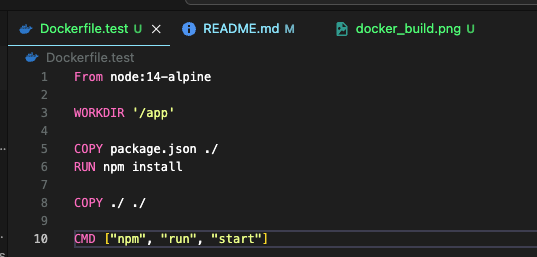
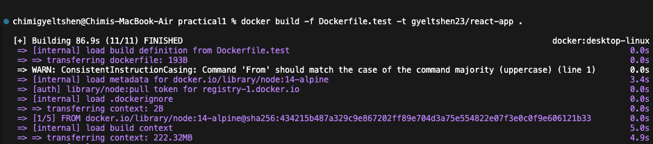
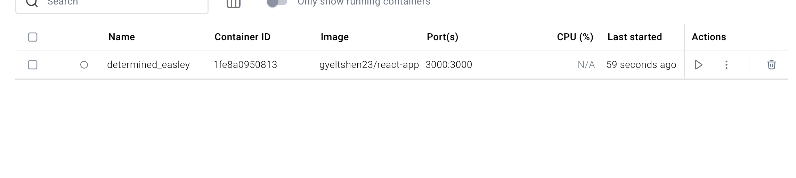
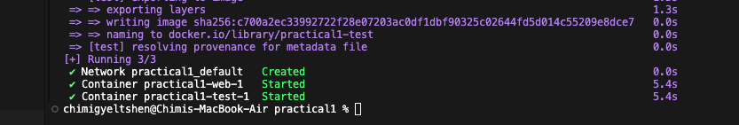
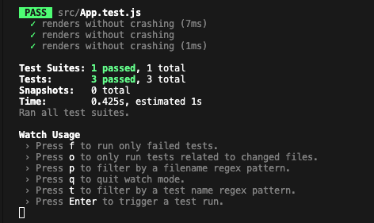

# Basic Docker Containerisation 

## Table of Contents

- [About the Project](#about-the-project)
- [Technologies Used](#technologies-used)
- [CI/CD Tools](#cicd-tools)
- [Getting Started](#getting-started)
- [Steps And Procedure](#steps-and-procedure)

## About the Project

A basic walkthrough to containerize a React.js project using Docker and manage it using Docker Compose.


## Technologies Used

- JavaScript / CSS  
- GitHub  
- Visual Studio Code

## CI/CD Tools

- GitHub for version control  
- Docker for containerization

## Getting Started

- **Prerequisites**

    Make sure you have Node.js and npm installed.


    ```bash 
    node -v
    npm install
    ```
- **Setup**

    - Clone the Repo 

        ````bash
        git clone https://github.com/douglasswmcst/reactjs-subdevice
        ````
    - Checkout to development branch

        ```bash
        git checkout development
        ```

    - Install application library 

        ```bash
        npm i 
        ```

## Steps And Procedure

- ### **Step 1. Create Dockerfile in the root folder**
    
    - Create a file name `Dcokerfile` in the root of the project.

        ```sh
        touch Dockerfile.test
        ```

        

- ### **Step 2. Building Docker Image**

    ```sh
    docker build -f Dockerfile.test -t gyeltshen23/react-app .
    ```
    Builds a ``Docker image`` using Dockerfile.test, names it `gyeltshen23/react-app`, and uses the current folder as the source.

    

- ### **Step 3. Run the docker image as container with port forward and volume mounting**

    ```sh
    docker run -d -p 3000:3000 -v /app/node_modules -v $(pwd):/app douglasswm/react-app
    ```

    

- ### **Step 4. Run the docker compose command to run multiple containers reflected in the docker-compose.yml file.**

    ```sh
    docker compose up -d --build
    ```

    

- ### **Step 5. Open an interaction shell inside running container allowing commands to be executed.**

    ```sh
    docker exec -it <container id> sh
    ```

    

