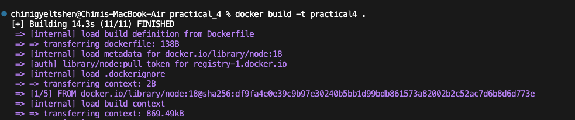
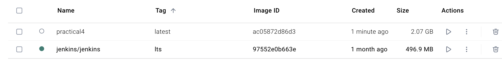
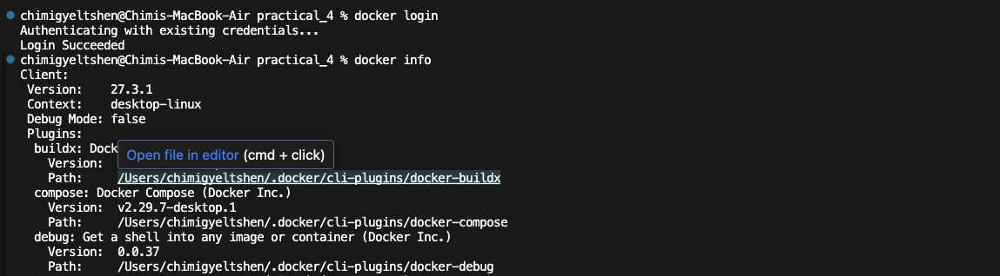
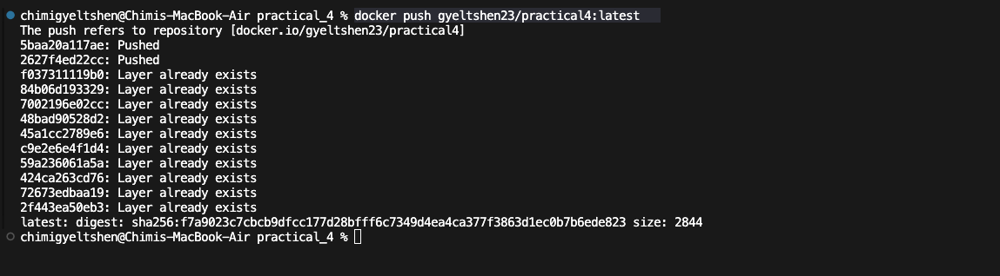
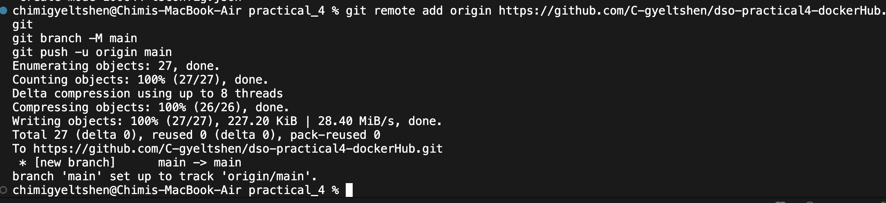
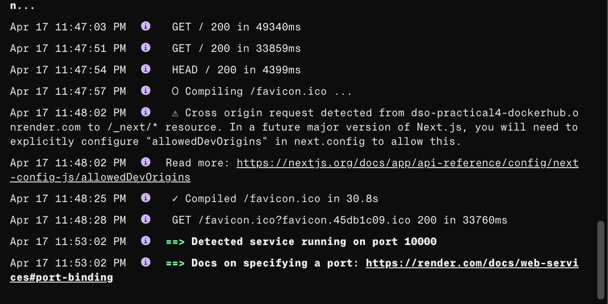

# Docker Hub 

## **Step1 : Create Dockerfile**

```dockerfile
FROM node:18

WORKDIR /app
COPY package*.json ./
RUN npm install
COPY . .
EXPOSE 3000
CMD npm run dev

```
## **Step2 : Create docker image**

```bash 
docker build -t practical4 .
```




## Step3 : Login to Docker Hub

```bash
docker login
```


## **Step3 : Push the docker image to DockerHub**

```bash
docker push gyeltshen23/practical4:latest
```


## Step4 : Push the application to a new Git repository

- Initialize a new **Git repository** and push the code to GitHub.

    ```bash
    git init
    git add .
    git commit -m "Initial commit"  
    git remote add origin https://github.com/C-gyeltshendso-practical4-dockerHub.git
    git branch -M main
    git push -u origin main

    ```
    

- Deploy the application to Render
- Create a new **Web Service** on Render and connect it to the GitHub repository you just created.
- Select the branch you want to deploy and choose the **Docker** option.
- Click on **Create Web Service** to start the deployment process.

    

    [Link](https://dso-practical4-dockerhub.onrender.com) of the deployed application.