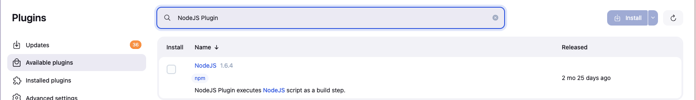
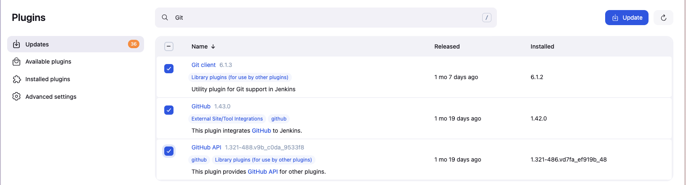
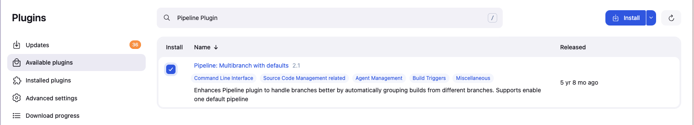
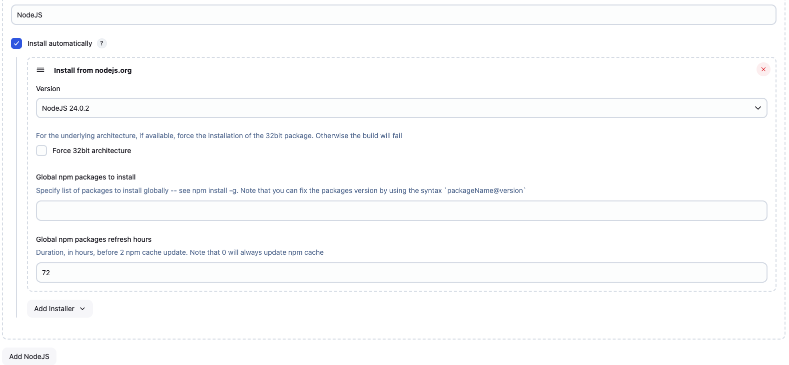
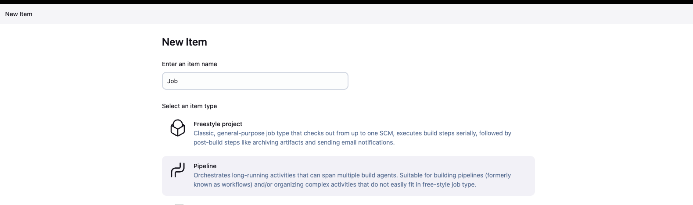
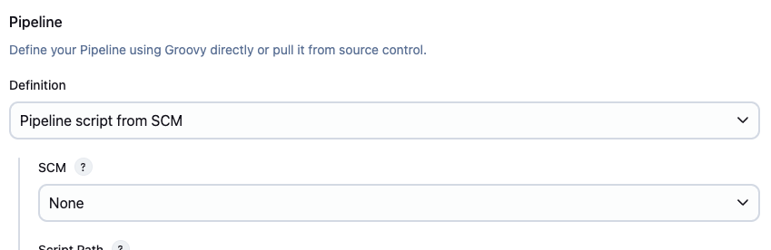
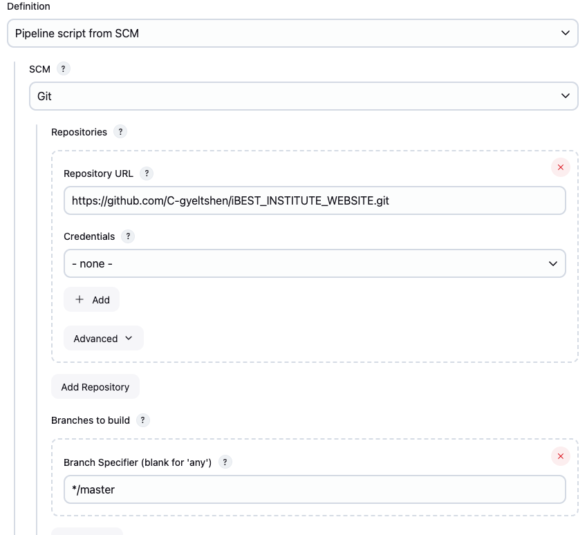
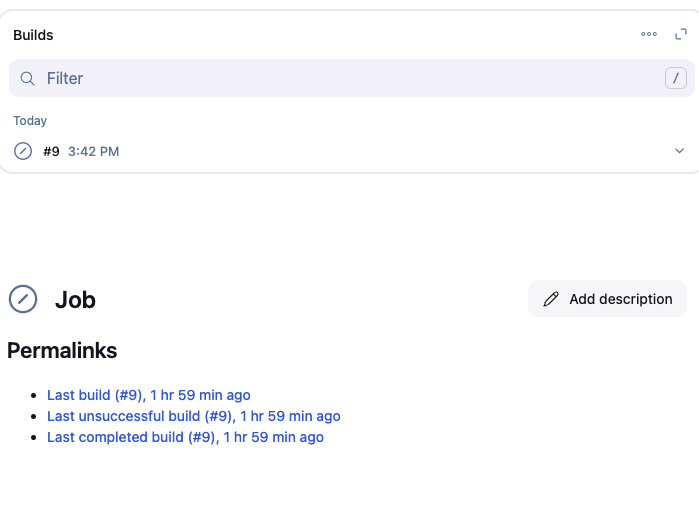
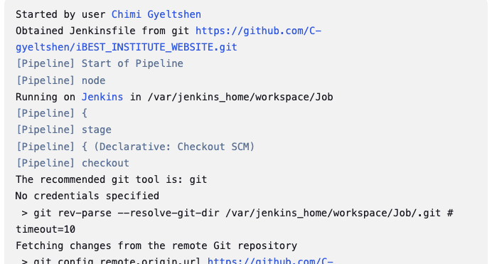

# Jenkins Server for a git repository

## Aim
To implement a robust CI/CD pipeline using Jenkins for automated testing, building, and deployment of a Node.js application hosted on GitHub.

## Objectives
1. Configure Jenkins server with essential plugins for Node.js development
2. Establish automated build and test workflows triggered by code changes
3. Implement deployment automation for staging/production environments
4. Integrate test reporting and build monitoring capabilities
5. Ensure the pipeline follows industry best practices for CI/CD

## Prerequisites
- Jenkins server installed and running
- GitHub account with repository access
- Node.js application with proper `package.json` scripts

## Github Repository
- [NodeJa application Link](https://github.com/C-gyeltshen/iBEST_INSTITUTE_WEBSITE.git)

## Installation & Configuration

- Go to Manage Jenkins > Manage Plugins and install the following plugins:

  ### 1. **NodeJS Plugin**

  - This plugin is used to install NodeJS on the Jenkins server. It allows you to specify the version of NodeJS you want to use in your pipeline.

    

  ### 2. **GitHub Plugin**

  - This plugin is used to integrate Jenkins with GitHub. It allows you to trigger builds based on GitHub events, such as push or pull request events.

    

  ### 3. **Pipeline Plugin**

  - This plugin is used to create Jenkins pipelines. It allows you to define your build process in a Jenkinsfile, which can be stored in your Git repository.

    

## Confeguring NodeJS in Jenkins

- Go to Manage Jenkins > Global Tool Configuration and scroll down to the NodeJS section. Click on "Add NodeJS" and specify the name and version of NodeJS you want to use. You can also choose to install it automatically.

  

## Creating a New Pipeline Job

### 1. Name the pipeline `"Job"` and select `"Pipeline"` as the project type.



### 2. Under pipeline settings choose

- Definition: Pipeline script from `SCM`
  

- SCM: `Git`

- Repository URL:[NodeJs App Repo](https://github.com/C-gyeltshen/iBEST_INSTITUTE_WEBSITE.git)

  

### 3. Inside the NodeJS app, create a file name `Jenkinsfile` and add the following code:

```groovy
    pipeline {
        agent any
        tools {
            nodejs 'NodeJS'  // Matches the name in GlobalTool Configuration
        }

        stages {
            stage('Install') {
            steps {
                sh 'npm install'
            }
            }
            stage('Test') {
            steps {
                    sh 'npm test'  // Make sure "test" script exists in package.json
            }
            }
            stage('Build') {
            steps {
                sh 'npm run build'  // Useful for Next.jsorReact apps
            }
            }
            stage('Deploy') {
            steps {
                sh 'echo "Deploying to staging..."'
                // Add your actual deployment steps here (eg. SSH, Docker, etc.)
            }
            }
        }
    }
```

The `jenkins pipeline script` above is a basic example of how to set up a jenkins pipeline for a NodeJs application which automates a NodeJS application in 4 stages:

1. `Install`: Installs the dependencies using `npm install`.

2. `Test`: Runs the tests using `npm test`. Make sure you have a test script defined in your `package.json`.

3. `Build`: Builds the application using `npm run build`. This is useful for applications built with frameworks like Next.js or React.

4. `Deploy`: This is a placeholder for your deployment steps. You can replace the `echo` command with actual deployment commands, such as SSH commands to deploy to a server or Docker commands to build and push a Docker image.

### 5. Save the pipeline and click on `Build Now` to run the pipeline.



### 6. Adding automated testing

1. Install Unit Testing Frameworks from Manage Jenkins > Manage Plugins:
    - The `JUnit Plugin` in Jenkins is used to process and visualize test reports (in JUnit XML format) generated by your test suite.

    - Update the Test stage to generate JUnit-compatible reports
        ```groovy
             stage('Test') {
                    steps {
                        sh 'npm test -- --ci --reporters=jest-junit'
                    }
                    post {
                        always {
                            junit 'junit.xml' // Path to test report
                        }
                    }
                }
        ```
    - Rebuild the pipeline and check the test results in Jenkins.
    

