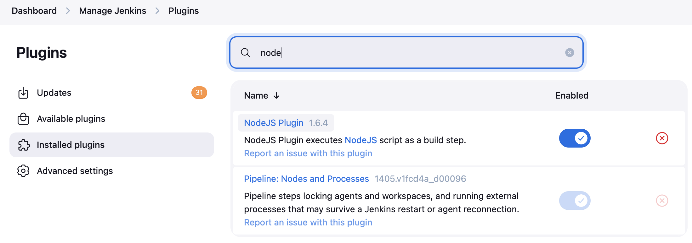
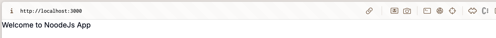
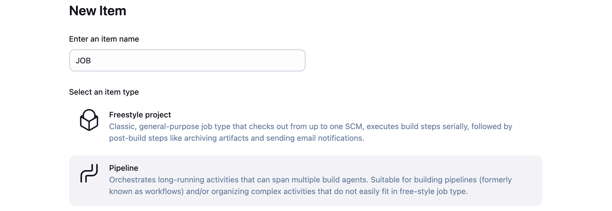
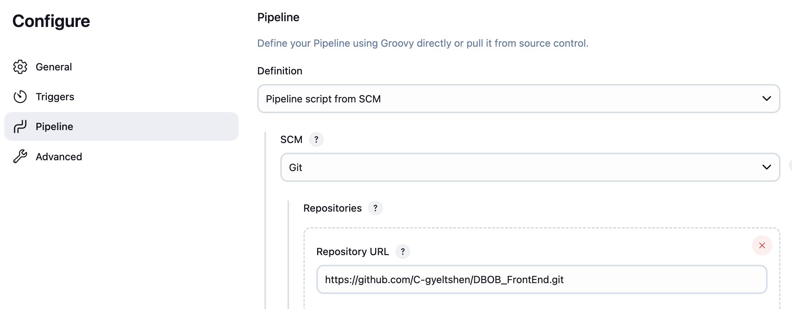

# Declarative pipeline for Jenkins and using external services

## Aim:
To learn how to create and configure a `Jenkins Declarative Pipeline` for automating Node.js application build, test, and deployment processes.

## Objectives:

- Set up Jenkins with `Node.js` and `Git plugins`.

- Create a `pipeline job` that uses a `Jenkinsfile` from a `Git repository`.

- Automate `install`, `build`, `test`, and `deploy` stages for a Node.js app.

- Extend the pipeline to `build` and push `Docker images` using Jenkins secrets.

## Prerequisites

- Jenkins server with Node.js and Git plugins installed

    

- A Node.js project repository (e.g., Express.js, React, or NestJS app)

    

- Basic familiarity with Jenkins and npm/yarn commands

## Git Repository
- [Node.js App Repository Link](https://github.com/C-gyeltshen/DBOB_FrontEnd.git)

## Create a New Pipeline Job

1. Open Jenkins and click on "New Item".

    

2. Defining pipeline from SCM (Source Code Management) Git with the main branch

    - Choose pipeline script from `SCM` and select `Git` with your git repository URL.
    
        

    - Change the branch to `main` or the branch you want to use.

        

    - Set script path to `Jenkinsfile` in your repository.

        

    - Defining pipeline from `SCM` (Source Code Management), `Git` with the main branch, it means that your CI/CD tool Jenkins will monitor and execute the pipeline based on the code and configuration found in the main branch of your Git repository.

    - Setting the script path to `Jenkinsfile` in your repository means that Jenkins will look for the pipeline configuration in that specific file, which contains the stages and steps to be executed during the pipeline run.

    
3. Inside the nodejs application root directory, create a file named `Jenkinsfile` and add the following code:

    ```bash 
    touch Jenkinsfile
    ```

    ```groovy
        pipeline {
        agent any
        tools {
            nodejs 'NodeJS-20.x'  
        }
        environment {
            CI = 'true'
        }
        stages {
            stage('Install') {
            steps {
                sh 'npm install'
            }
            }
            stage('Build') {
            steps {
                sh 'npm run build'  // For frameworks like React, Next.js
            }
            }
            stage('Test') {
            steps {
                sh 'npm test'
            }
            post {
                always {
                junit 'junit.xml'  // Test reports (if using jest-junit)
                }
            }
            }
            stage('Deploy') {
            steps {
                script {
                if (env.BRANCH_NAME == 'main') {
                    sh 'npm run deploy:prod'
                } else {
                    sh 'npm run deploy:stage'
                }
                }
            }
            }
        }
        }
    ```

    - The above code is a `Jenkinsfile` that defines a declarative pipeline for a Node.js application. It includes stages for installing dependencies, building the application, running tests, and deploying it based on the branch name.
    - The pipeline uses the `NodeJS-20.x` tool, which should be configured in Jenkins under "Global Tool Configuration". This ensures that the correct version of Node.js is used during the pipeline execution.
    - The `environment` block sets the `CI` environment variable to `true`, which is commonly used in continuous integration environments.