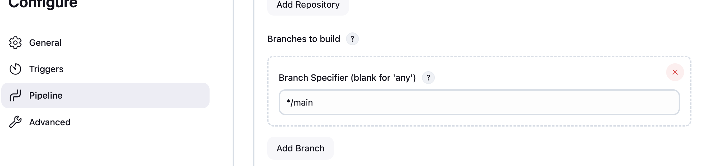

# Declarative pipeline for Jenkins and using external services

## Aim:
To learn how to create and configure a `Jenkins Declarative Pipeline` for automating Node.js application build, test, and deployment processes.

## Objectives:

- Set up Jenkins with `Node.js` and `Git plugins`.

- Create a `pipeline job` that uses a `Jenkinsfile` from a `Git repository`.

- Automate `install`, `build`, `test`, and `deploy` stages for a Node.js app.

- Extend the pipeline to `build` and push `Docker images` using Jenkins secrets.

## Prerequisites

- Jenkins server with Node.js and Git plugins installed

    

- A Node.js project repository (e.g., Express.js, React, or NestJS app)

    

- Basic familiarity with Jenkins and npm/yarn commands

## Create a New Pipeline Job

1. Open Jenkins and click on "New Item".

    

2. Defining pipeline from SCM (Source Code Management) Git with the main branch

    - Choose pipeline script from `SCM` and select `Git` with your git repository URL.
    
        

    - Change the branch to `main` or the branch you want to use.

        

    - Set script path to `Jenkinsfile` in your repository.

        

    - Defining pipeline from `SCM` (Source Code Management), `Git` with the main branch, it means that your CI/CD tool Jenkins will monitor and execute the pipeline based on the code and configuration found in the main branch of your Git repository.

    - Setting the script path to `Jenkinsfile` in your repository means that Jenkins will look for the pipeline configuration in that specific file, which contains the stages and steps to be executed during the pipeline run.

    

3. 