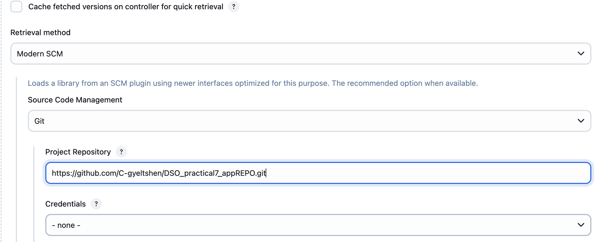

# Practicals 7: Creating shared library in Jenkins

## Aim: 
To understand the concept, structure, and implementation of Shared Libraries in Jenkins and apply them to modularize and reuse pipeline code efficiently across multiple Jenkins projects.

## Objectives:
1. Understand the purpose and benefits of using Shared Libraries in Jenkins CI/CD pipelines.
2. Explore the structure of a Jenkins Shared Library (`vars/`, `src/`, `resources/` folders).
3. Create a custom shared library with reusable functions and classes.
4. Integrate the shared library into a Jenkins project using the `@Library` annotation.
5. Develop and test reusable functions using Groovy for common pipeline steps (e.g., build, test, deploy).
6. Configure Jenkins to recognize and use a shared library from a remote Git repository.
7. Implement best practices for writing clean, maintainable, and version-controlled pipeline code.

### Extending jankins with shared libraries 

As Pipeline is adopted for more and more projects in an organization, common patterns are likely to emerge. Oftentimes it is useful to share parts of Pipelines between various projects to reduce redundancies and keep code "DRY".

Pipeline has support for creating "**Shared Libraries**" which can be defined in `external source control repositories` and loaded into `existing Pipelines`.

### What is a Shared Library?

A **shared library** is a **centralized Groovy codebase** that can be used across multiple Jenkins pipelines (typically scripted pipelines written in Groovy).

### Directory Structure
The directory structure of a Shared Library repository is as follows:
````
(root)
+- src                     # Groovy source files
|   +- org
|       +- foo
|           +- Bar.groovy  # for org.foo.Bar class
+- vars
|   +- foo.groovy          # for global 'foo' variable
|   +- foo.txt             # help for 'foo' variable
+- resources               # resource files (external libraries only)
|   +- org
|       +- foo
|           +- bar.json    # static helper data for org.foo.Bar
````

#### `src/` Directory
- This directory is used for writing `Groovy classes`.
- Example : **Bar.groovy** is a class you can use in other scripts.

    ```groovy 
    src/org/foo/Bar.groovy
    ```

#### `vars/` Directory

- Anything in the `vars` are considered as global variables from jenkins perspective.

- Globle variables are can be created on `Folder-level`.

- The main difference between the Globle-level adn the Folder-level is that Folder-scoped libraries are always considered `“untrusted”`.


#### `resources/` Directory

- This folder is for static files like .json, .html, etc.

- These files can be loaded and used by your Groovy scripts.

## Creating a Global Shared Library

### Step 1: Naviage to 


### Step 2: Press **add** button `Global Trusted Pipeline Libraries`


### Step 3: Fill the form


#### 1. **Library Name**

- The `Library Name` is the name you give to your shared library in Jenkins.

- You use this name in your Jenkinsfile to load the library like this:

    ```groovy
    @Library('my-shared-library') _
    ```

- It tells Jenkins which `library` to load.

#### 2. **Default Version**

- This is the **Git branch**, **tag**, or **commit** that Jenkins will use by default when loading the library.

- Example:
If you set **main** as the default version, Jenkins will pull the code from the main branch.

- You can override the version in your **Jenkinsfile** like this:

    ```groovy
    @Library('my-shared-lib@develop') _
    ```

### 3. Provide git repository URL

- [Repository URL](https://github.com/C-gyeltshen/DSO_practical7_appREPO.git)

    

### Step 4: Save and Validate

- After saving, go to `Manage Jenkin > System > Global Trusted Pipeline Libraries `

- You should see the repositorys latest commit id `0c9d639628a0ed6880031099cb98462484ffa12d`

    
    


### Step 5: Create a New Pipeline "test-pipeline"


- Add git repository URL of the nodeJs application

    

- Change the github branch to `main` and click **Save**.

### Step 6: Store Dcokerhub credentials in jenkins

- Go to 

    

- under Global credentials, click on **Add Credentials** and choose **Username with password**.
- **Username**: your dockerhub username
- **Password**: your dockerhub password or access token
- **ID**: you can set an ID like `dockerhub-credentials` for easy reference.
- **Description**: optional, but you can add something like "DockerHub credentials for pushing images".
- Click **OK** to save the credentials.

    

### Step 7: Create Dockerfile under the nodeJs application root.
- Create a file named `Dockerfile` in the root

```bash 
touch Dockerfile
```
- Add the following content to the `Dockerfile`:

```dockerfile
FROM node:18

WORKDIR /app
COPY package*.json ./
RUN npm install
COPY . .
EXPOSE 3000
CMD npm run dev
```
### Step 8 : Create docker image and push to dockerhub

```bash 
docker build -t gyeltshen23/dso-p7 .
```
```bash
dokcer login
```
```bash
docker push gyeltshen23/dso-p7
```


### Step 9: Create Jenkinsfile in the root of the nodeJs application
- Create a file named `Jenkinsfile` in the root of the nodeJs application.

```bash
touch Jenkinsfile
```
- Add the following content to the `Jenkinsfile`:

```groovy
pipeline {
    agent any

    environment {
        // DockerHub credentials ID stored in Jenkins
        DOCKER_CREDENTIALS_ID = 'meopen123'  
        DOCKER_IMAGE_NAME = 'gyeltshen23/dso-p7'  
    }

    stages {
        stage('Install Dependencies') {
            steps {
                script {
                    nodeUtils.installDependencies()
                }
            }
        }

        stage('Run Tests') {
            steps {
                script {
                    nodeUtils.runTests()  // This should run 'npm test'
                }
            }
        }

        stage('Build Docker Image') {
            steps {
                script {
                    dockerUtils.buildDockerImage(env.DOCKER_IMAGE_NAME)
                }
            }
        }

        stage('Push Docker Image') {
            steps {
                script {
                    dockerUtils.pushDockerImage(env.DOCKER_IMAGE_NAME, env.DOCKER_CREDENTIALS_ID)
                }
            }
        }
    }
}
```

### Step 10: Run the pipeline 

### Error: The error shows that Docker is not available inside your Jenkins container. The key error is:

```bash
docker: not found
```


### Solution:
1. The solution is to run the Jenkins container with Docker installed. You can do this by using the `docker:dind` (Docker-in-Docker) image. This allows you to run Docker commands inside the Jenkins container.

2. Install jekins in local machine and Build the pipeline.


