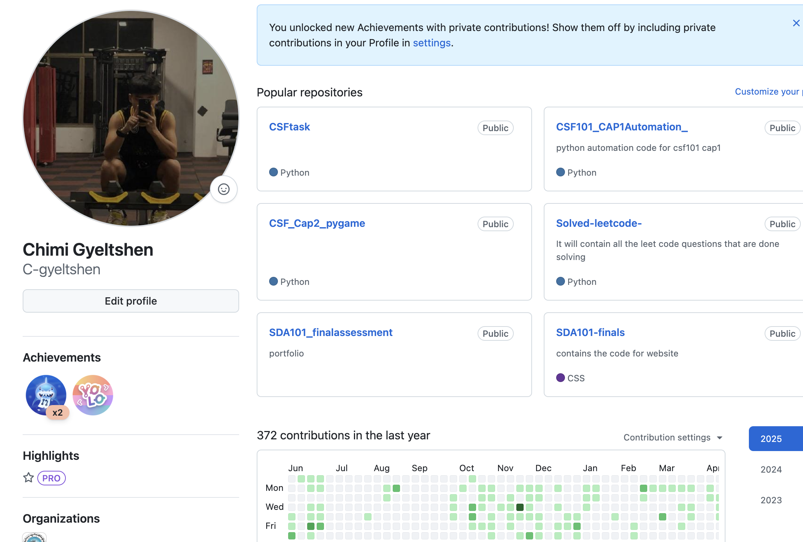
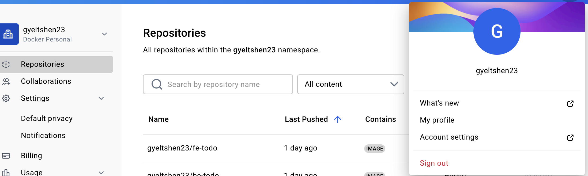
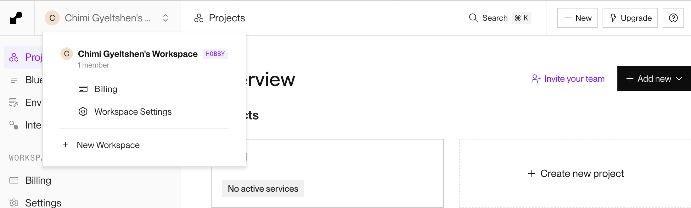
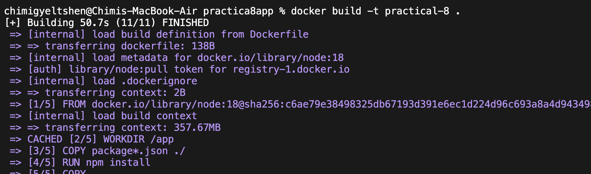
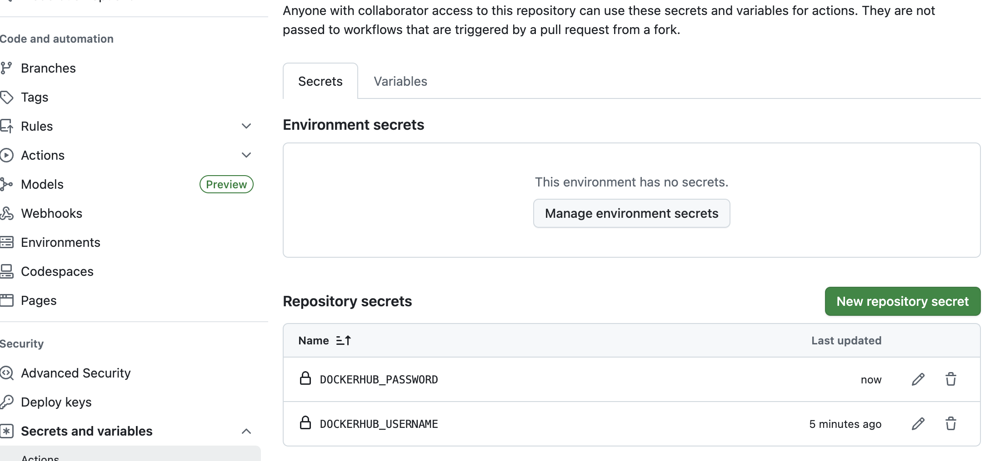

# Practicals 8: Implement a complete CICD workflow using Github actions and deploy your application. 

## Aim

To implement a complete CI/CD workflow using GitHub Actions by building and pushing Docker images on every push, and deploying the application to Render using Docker Hub.

## Objectives

- To understand the concepts and benefits of CI/CD in modern DevOps practices.
- To create a simple Node.js static site and containerize it using Docker.
- To configure a GitHub Actions workflow that:
    - Builds the Docker image on every push.
    - Pushes the Docker image to Docker Hub.
- To automate deployment by connecting Docker Hub to Render and triggering deployment on every push.
- To gain hands-on experience with multi-service application deployment using GitHub, Docker, and Render.
- To familiarize with writing and configuring CI/CD pipelines using GitHub Actions and YAML syntax.

## Prerequisites

- A **GitHub account** (for repository & GitHub Actions).

    

- A **Docker Hub account** (to store Docker images).

    

- A **Render account** (for deployment).

    

- Basic knowledge of **Docker** and **YAML syntax**

## Create a Simple Node.js Static Site (Next.js)

### Install Nextjs App

```bash 
npx create-next-app@latest practical-8
```
### Navigate to the Project Directory

```bash
cd practical-8
```
### Run the Application Locally

```bash
npm run dev
```
- Add a simple todo code in `app/page.tsx`

### Create a Dockerfile in the root of your project

```dockerfile
FROM node:18

WORKDIR /app
COPY package*.json ./
RUN npm install
COPY . .
EXPOSE 3000
CMD npm run dev
```

- #### **Build Docker Image**

    ```bash
    docker build -t practical-8 .
    ```
    
    


- ### Store Dockerhub Credentials in GitHub Secrets

    - Go to your GitHub repository.
    - Navigate to **Settings** > **Secrets and variables** > **Actions**.
    - Click on **New repository secret**.
    - Add the following secrets:
        - `DOCKER_USERNAME`: Your Docker Hub username.
        - `DOCKER_PASSWORD`: Your Docker Hub password.

            

- ### Create the GitHub actions workflow

    - Create `.github/workflow/docker-image.yml` in your project directory.
    - Add the following content to the file:

    ```yaml
        name: ci

        on:
        push:

        jobs:
        docker:
            runs-on: ubuntu-latest
            steps:
            -
                name: Login to Docker Hub
                uses: docker/login-action@v3
                with:
                username: ${{ vars.DOCKERHUB_USERNAME }}
                password: ${{ secrets.DOCKERHUB_TOKEN }}
            -
                name: Set up QEMU
                uses: docker/setup-qemu-action@v3
            -
                name: Set up Docker Buildx
                uses: docker/setup-buildx-action@v3
            -
                name: Build and push
                uses: docker/build-push-action@v6
                with:
                push: true
                tags: user/app:latest
    ```
    - 

- ### Commit and Push Changes

    ```bash
    git add .
    git commit -m "Add GitHub Actions workflow for Docker image build"
    ```


