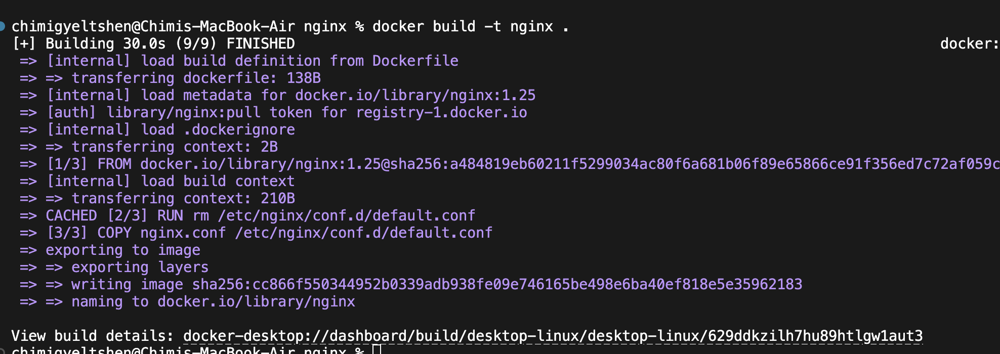
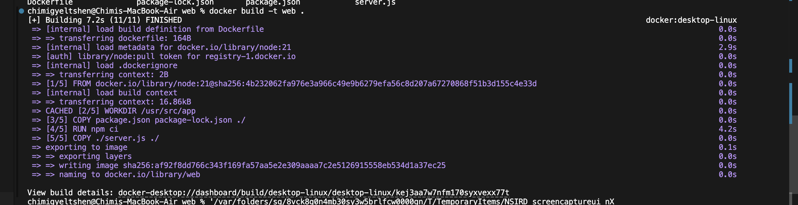
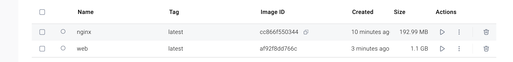
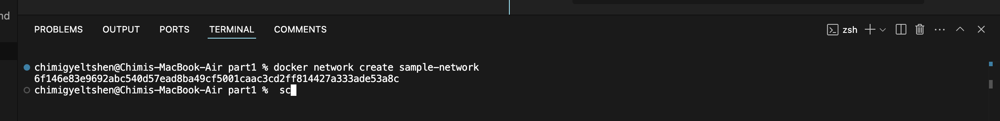

# Practical 2 Part 1 

## Introduction
## Procedures and Results

### **Step1. Building Docker image for both services**

- Docker image for nginx service
  ```sh
  docker build -t nginx .
  ```
  

- Docker image for nodejs service
  ```sh
  docker build -t web .
  ```
  

  

### **Step2. Creating a network for containers to communicate**

```sh
docker network create sample-netwrok
```


### **Step3. creating container with specific configuration**


