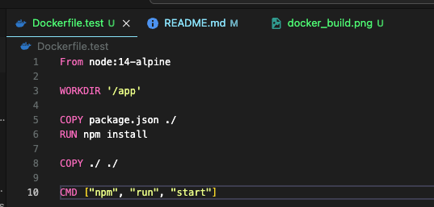
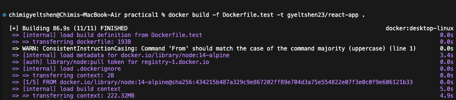
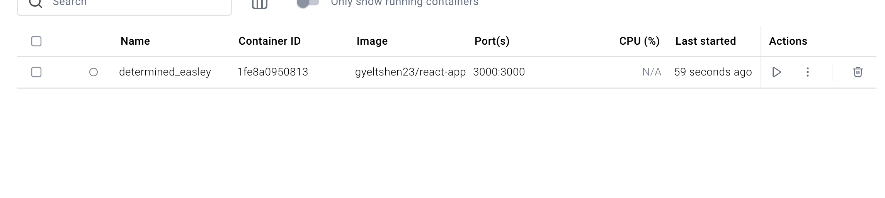
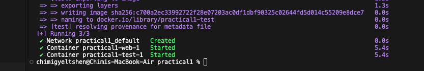
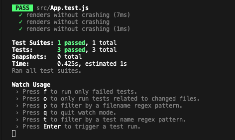

- create docker file in the root folder

    ```
    touch Dockerfile.test
    ```




- Building docker image

    ```
    docker build -f Dockerfile.test -t gyeltshen23/react-app .
    ```
    

- Run the docker image as container with port forward and volume mounting

    ```
    docker run -d -p 3000:3000 -v /app/node_modules -v $(pwd):/app douglasswm/react-app
    ```

    

- Run the docker compose command to run multiple containers reflected in the docker-compose.yml file.

    ```
    docker compose up -d --build
    ```

    

- Open an interaction shell inside running container allowing commands to be executed.

    ```
    docker exec -it <container id> sh
    ```

    

- 