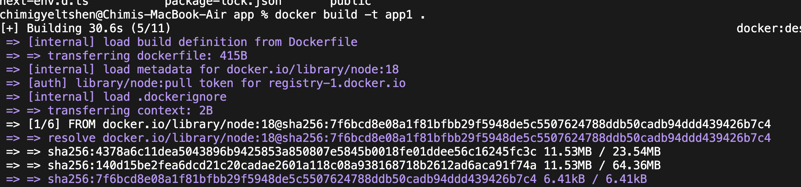
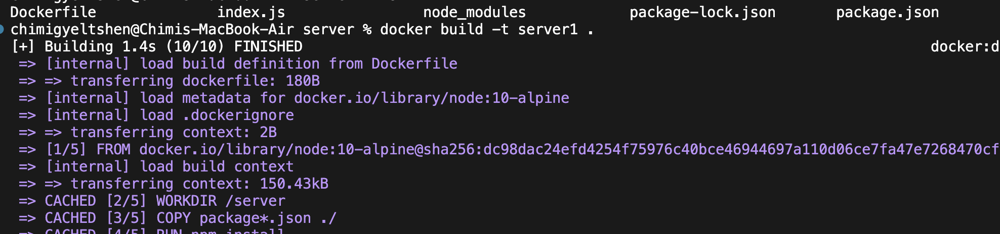
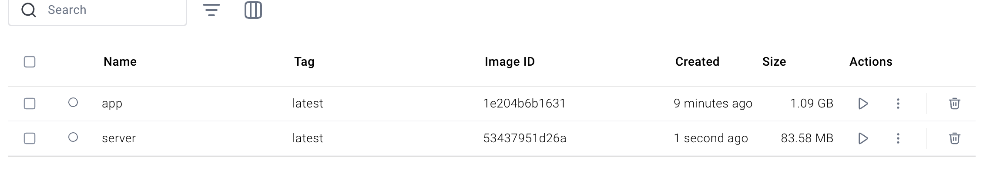
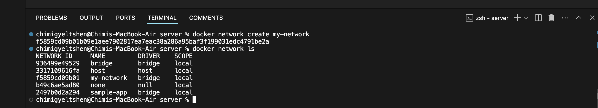
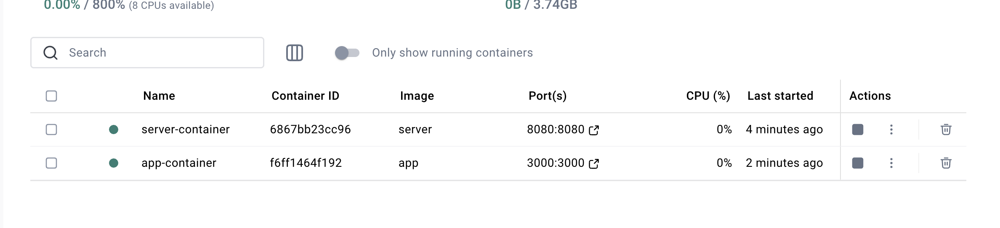
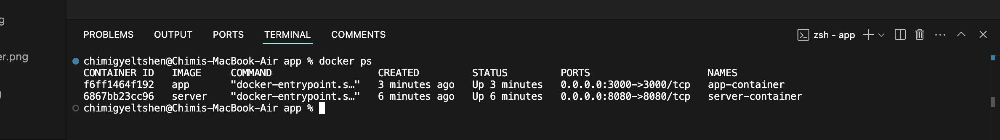
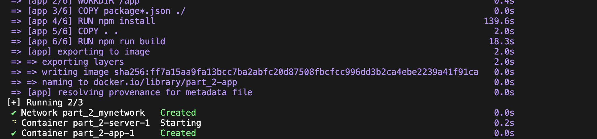

# Practical 2:

## How to test this application

Step 1: Git clone the follow repo.  
Step 2: ```npm install ws``` the dependencies in the server directory.  
Step 3: Use ```npm start``` command to run the server.  
Step 4: Use http-server command in app to start the front end.   


## part 2 chellege 

### **1. Build docker image for both app and server.**

* Dockerfile for app
```sh
# Use an official Node.js runtime as the base image
FROM node:18

# Set the working directory inside the container
WORKDIR /app

# Copy the rest of the application code
COPY . .

# Expose the port your app runs on
EXPOSE 3000

# Command to run your app
CMD ["http-server"]
```

* Build docker imgage for app

```sh
docker build -t app .
```


* Dcokerfile for server

```sh
FROM node:10-alpine

WORKDIR /server

COPY package*.json ./

RUN npm install

COPY --chown=node:node . .

EXPOSE 8080

CMD [ "npm", "start" ]
```

* Build docker image for server 

```sh
docker build -t server .
```




### **2. Create a custom network for containers to communicate**

```sh
docker network create my-network
```



### **3. Create Containers for both services**

**1. Create a new conatiner for server service**

```sh
docker run -d --name server-container --network my-network --network-alias server-container server
```


Creat and run a new container named **server-container** on the network **my-conatiner** and provided an alternative name **server-network** for other conatiner to communicate with this container with the help of **server** docker image.

**2. Created a new container for app service**

```sh
docker run -d --name app-container --network my-network --network-alias app-container -p 3000:3000 app   
```


**3. Check the running containers**

```sh
docker ps
```


**4. Create compose.yml file**

```sh
touch compose.yml
```

