# Docker Compose practical 

## Step 1: Setup

1. Create a file called app.py

```python
    import time

    import redis
    from flask import Flask

    app = Flask(__name__)
    cache = redis.Redis(host='redis', port=6379)

    def get_hit_count():
        retries = 5
        while True:
            try:
                return cache.incr('hits')
            except redis.exceptions.ConnectionError as exc:
                if retries == 0:
                    raise exc
                retries -= 1
                time.sleep(0.5)

    @app.route('/')
    def hello():
        count = get_hit_count()
        return f'Hello World! I have been seen {count} times.\n'
```

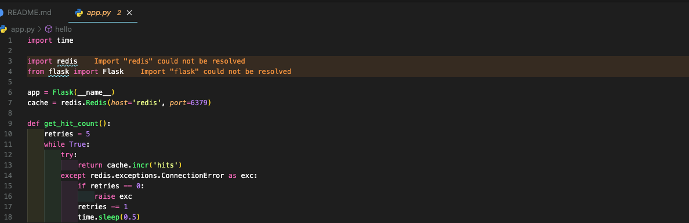

2. Create file called requirements.txt

```txt
    flask
    redis
```
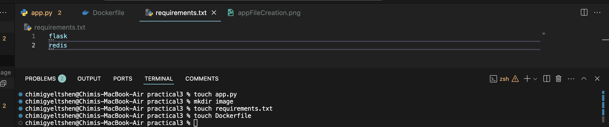

3. Create Dockerfile
```
    # syntax=docker/dockerfile:1
    FROM python:3.10-alpine
    WORKDIR /code
    ENV FLASK_APP=app.py
    ENV FLASK_RUN_HOST=0.0.0.0
    RUN apk add --no-cache gcc musl-dev linux-headers
    COPY requirements.txt requirements.txt
    RUN pip install -r requirements.txt
    EXPOSE 5000
    COPY . .
    CMD ["flask", "run", "--debug"]
```
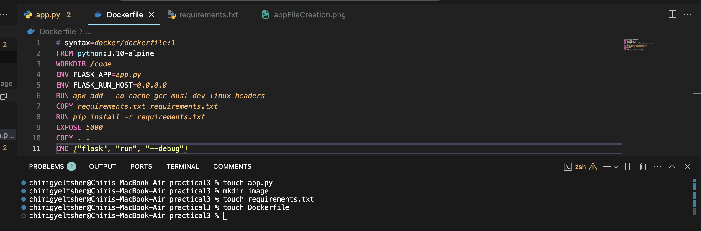

## Srep 2 : Define services in a Compose file

1. Create compose.yml file

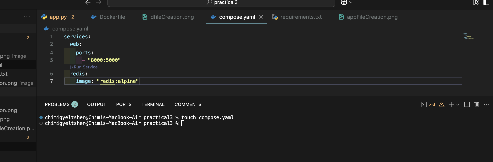

## Step 3: Build and run your app with Compose

1. Starting up your application by running
```
docker compose up.
```
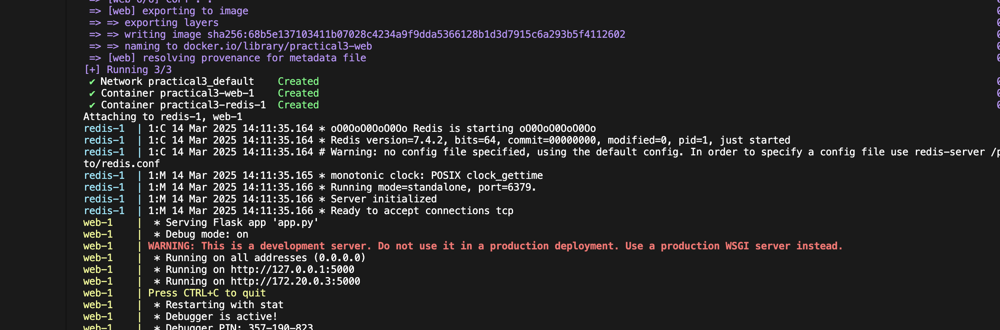

2. View application

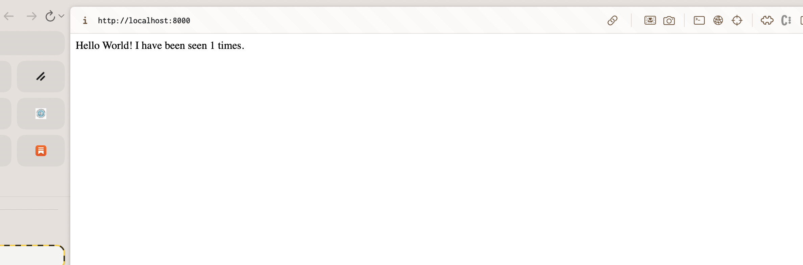

3. List all the docker images 

```
docker image ls 
```
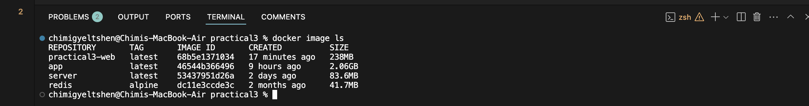

## Step 4: Step 4: Edit the Compose file to use Compose Watch

1. Edit the docker compose file

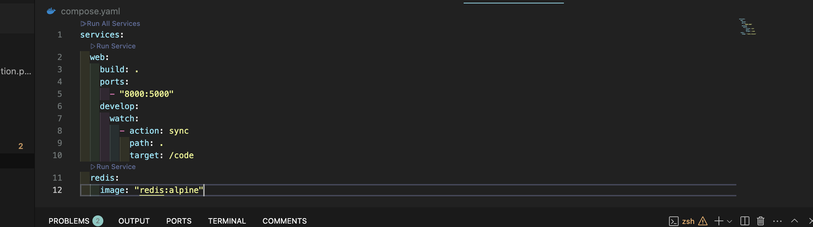

## Step 5: Re-build and run the app with Compose

1. Build and launch the app and start the file watch mode.

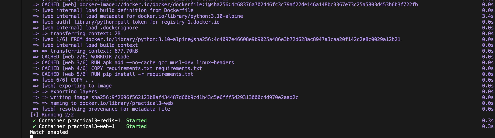

## Step 6: Update the application

1. Change the greeting in app.py

```python
    return f'Hello from Docker! I have been seen {count} times.\n'
```

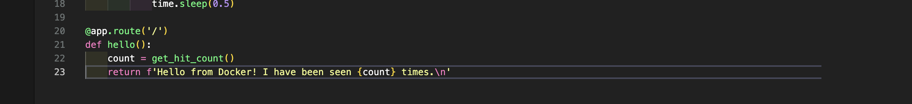

2. Refreashing the page for the changes to take effect

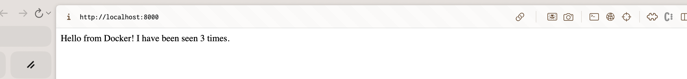

3. Stop docker compose

```
docker compose down
```
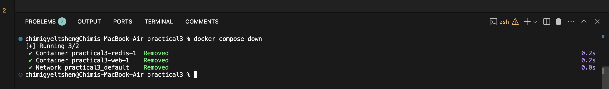

## Step 7: Split up your services

1. Create infra.yml file and populate infra.yml with the following content:

```
touch infra.yml
```

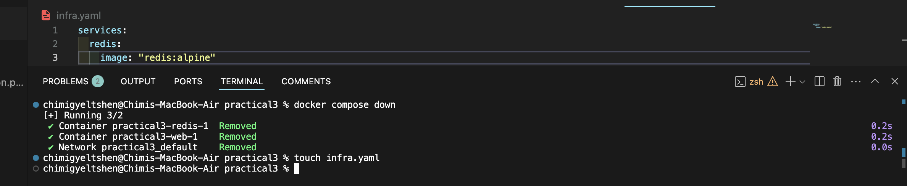

2. Edit compose.yml file

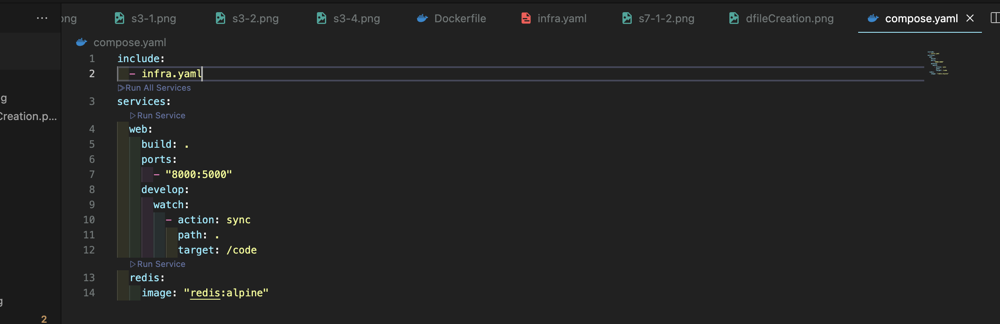

3. Docker compose up

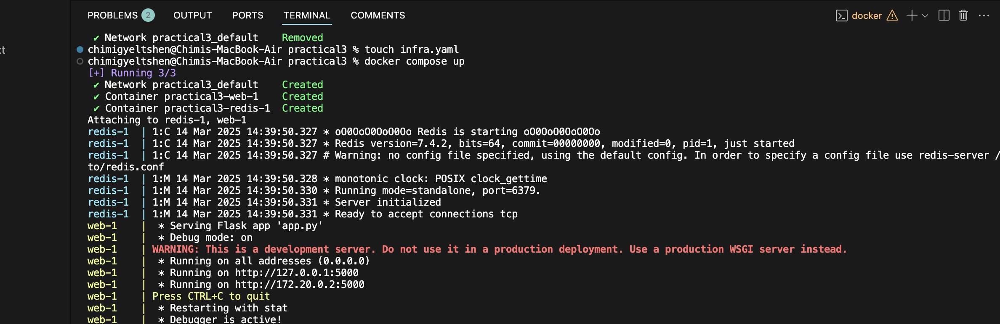


