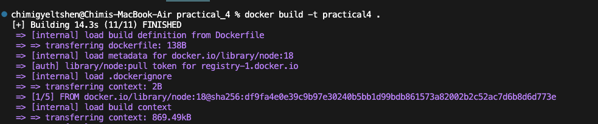
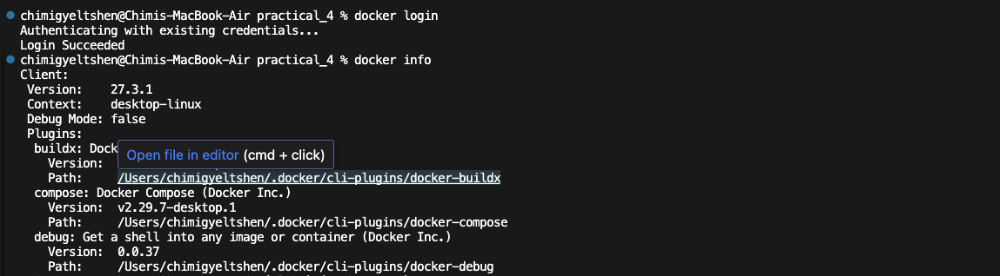
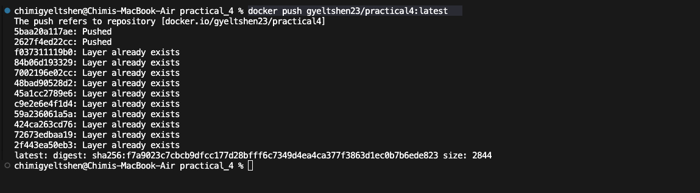

# Docker Hub 

## **Step1 : Create Dockerfile**

```dockerfile
FROM node:18

WORKDIR /app
COPY package*.json ./
RUN npm install
COPY . .
EXPOSE 3000
CMD npm run dev

```
## **Step2 : Create docker image**

```bash 
docker build -t practical4 .
```



## Step3 : Login to Docker Hub

```bash
docker login
```


## **Step3 : Push the docker image to DockerHub**

```bash
docker push gyeltshen23/practical4:latest
```
