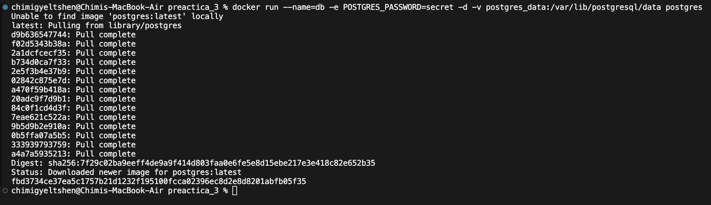
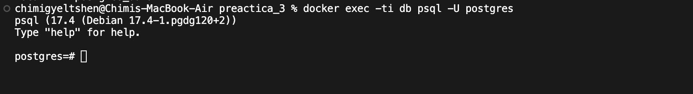
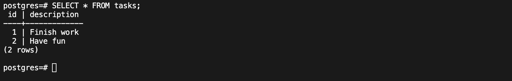
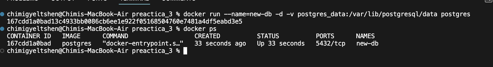
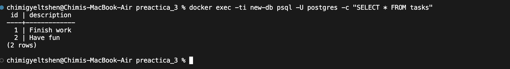
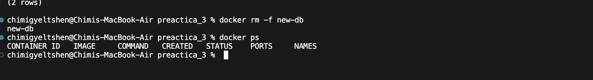

# Persisting Container Data

Each container can **create**, **modify**, and **delete** files independently. However, when a container is deleted, any changes to its files are also lost.

While this behavior is useful for testing, it is not ideal for production environments where data persistence is required across container restarts or different containers.

For example, if you restart a database container, you likely want to retain its data rather than start with an empty database. So, how do you persist files?

## Container Volumes

Volumes are a storage mechanism that allow data to persist beyond the lifecycle of an individual container.

### Managing Docker Volumes

- **Create** a new volume:

    ```sh
    docker volume create <volume-name>
    ```

- **List** all volumes:

    ```sh
    docker volume ls
    ```

- **Remove** a Docker volume (only works if no container is using it):

    ```sh
    docker volume rm <volume-name>
    ```

- **Remove all unused volumes:**

    ```sh
    docker volume prune
    ```

## Docker Volume Exercise

### 1. Creating a Database Container with Persistent Data

```sh
docker run --name=db -e POSTGRES_PASSWORD=secret -d -v postgres_data:/var/lib/postgresql/data postgres
```

This command creates a new container named **db** using the official PostgreSQL image, setting up a volume named **postgres_data** to persist data in the **/var/lib/postgresql/data** directory. The **-d** flag runs the container in detached mode.




### 2. Connecting to the Database

```sh
docker exec -ti db psql -U postgres
```

This command connects to the **db** container and opens a `psql` shell as the **postgres** user. The **-ti** flag allows interaction with the container's terminal.



### 3. Creating a Table Named `tasks` and Inserting Data Records

```sql
CREATE TABLE tasks (
    id SERIAL PRIMARY KEY,
    description VARCHAR(100)
);
INSERT INTO tasks (description) VALUES ('Finish work'), ('Have fun');
```

This command creates a table named **tasks** with **id** and **description** columns, then inserts two records into the table.

### 4. Verifying Data

```sql
SELECT * FROM tasks;
```



This command retrieves all records from the **tasks** table. You should see the two inserted records.

### 5. Stopping and Removing the Container to Check Data Persistence

```sh
docker stop db 
docker rm db
```

This command stops and removes the **db** container. The data in the **postgres_data** volume should still persist.

### 6. Starting a New Container with the Same Volume

```sh
docker run --name=new-db -d -v postgres_data:/var/lib/postgresql/data postgres 
```



This command creates a new container named **new-db**, attaching it to the existing **postgres_data** volume. The data from the previous container should still be available.

### 7. Verifying Data Persistence

```sh
docker exec -ti new-db psql -U postgres -c "SELECT * FROM tasks;"
```



This command connects to the **new-db** container and retrieves all records from the **tasks** table. The same records inserted earlier should appear.

### 8. Removing the Volume

- Before removing a volume, it **must not be attached to any containers**.
- First, remove the container:

    ```sh
    docker rm new-db
    ```

    

- Then, remove the volume:

    ```sh
    docker volume rm postgres_data
    ```

    
